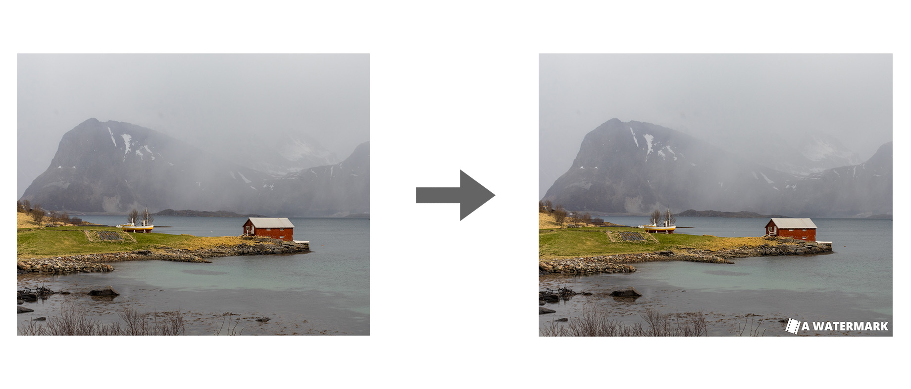

# WatermarkTool

A simple utility to add a watermark to images



## Basic usage

```
WatermarkTool - A basic utility to add a watermark to an image.

Usage:
  ./watermark-tool [OPTION...] FILE

  -v, --verbosity             Increase verbosity level
  -q, --quiet                 Don't output anything
  -c, --corner N              Set the corner. 0: Upper left / 1:Upper right /
                              2: Lower left / 3: Lower right (default: 3)
  -i, --image FILE            Image on which to add the watermark
  -o, --output FILE           Output image
  -b, --black-watermark FILE  The black watermark
  -w, --white-watermark FILE  The white watermark
  -h, --help                  Print this help
```

To add a matermak on the upper-right corner, and choose the color automatically:

```
./watermark-tool -c 1               \
  -w watermarks/watermark-white.png \ 
  -b watermarks/watermark-black.png \
  -o img/my_watermarked_image.jpg   \
  -i img/my_image.jpg
```

## Install

```
$ cmake -DCMAKE_CXX_FLAGS="-std=c++11" && make && ./watermark-tool -h
```


## TODO

- add support for directories, with the following options:
    - (-d,--directory DIR) the directory to process
    - (-r,--recursive) if the algorithm should be recursive
    - (--output-directory DIR) an optional output directory, default being "initial-dir" + " - WM", created if it does not exist
- add support for an offset, with the following options:
    - (--offset-x X), X offset
    - (--offset-y Y), Y offset
- optimize the watermark decision by analyzing only a rectangle with the dimensions of the watermark and not of the watermark's file dimensions
